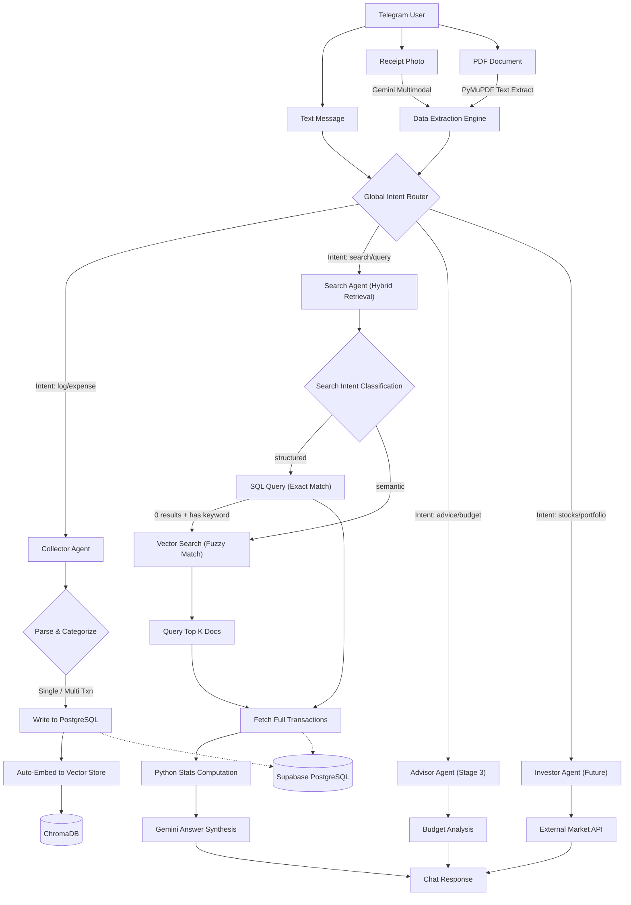

# FinPilot AI [Working]

FinPilot AI is a Telegram-native, multi-agent AI financial co-pilot designed to track, analyze, and manage personal finance. The system orchestrates three specialized agents to provide a unified financial experience:
- **Collector Agent**: Automatically captures and categorizes income, expenses, and invoices from plain text or receipt photos via OCR.
- **Advisor Agent**: Manages budgets, calculates financial metrics, and provides personalized, conversational advisory.
- **Investor Agent**: Tracks investment portfolios, logs mutual funds/SIPs, and runs live stock research.

Telegram Bot: @kharchabot_AI_assistant_bot

## Technical Stack
- Core Framework: FastAPI, Python
- Telegram API: python-telegram-bot
- Database: Supabase PostgreSQL, SQLAlchemy, asyncpg
- Artificial Intelligence: Google Gemini API (with 5-model dynamic fallback)
- Image Processing & OCR: Pillow, Tesseract OCR
- Logging: structlog

## Complete Project Features
- Natural Language Parsing: Parse expense and income details from normal chat messages (e.g. "spent 500 on dinner")
- Receipt OCR Scanning: Auto-extract transaction details (items, prices, tax, totals, date) from uploaded photos
- Recurring Bill & EMI Tracking: Log, list, and monitor recurring payments
- Smart Reporting & Analysis: Custom duration reports, month-on-month summary, and income-vs-expense ratios
- Semantic Search & Memory Layer: Query past transactions in natural language (e.g. "How much did I spend on food last month?")
- Offline Exporter: Export 90-day transactions to a CSV spreadsheet

## Done Till Now
- Project Scaffolding & Environment Setup
- Supabase Integration (with Render IPv4 connectivity workarounds and connection pooler integration)
- Dynamic Gemini Fallback Engine (supporting gemini-2.5-flash, gemini-3.1-flash-lite, gemini-2.0-flash, gemini-3-flash-preview, gemini-flash-latest)
- Natural Language Expense Logging
- Robust OCR Receipt Parser (with image resizing, contrast/sharpness enhancements, and double-summing protection)
- 7 Core Slash Commands (/start, /log, /emi, /summary, /report, /compare, /export, /history)
- Webhook Integration for Render Deployments & Polling Script for Local Development

## To Be Done
- ChromaDB integration for semantic search, salary slip and credit card statement PDF parsing (Stage 2) - **Completed**
- Advisor Agent with personalized budget rules, expense threshold alerts, and conversational financial advice (Stage 3)
- Multi-currency support and integration with external exchange rate APIs (Stage 4)

## System Architecture

