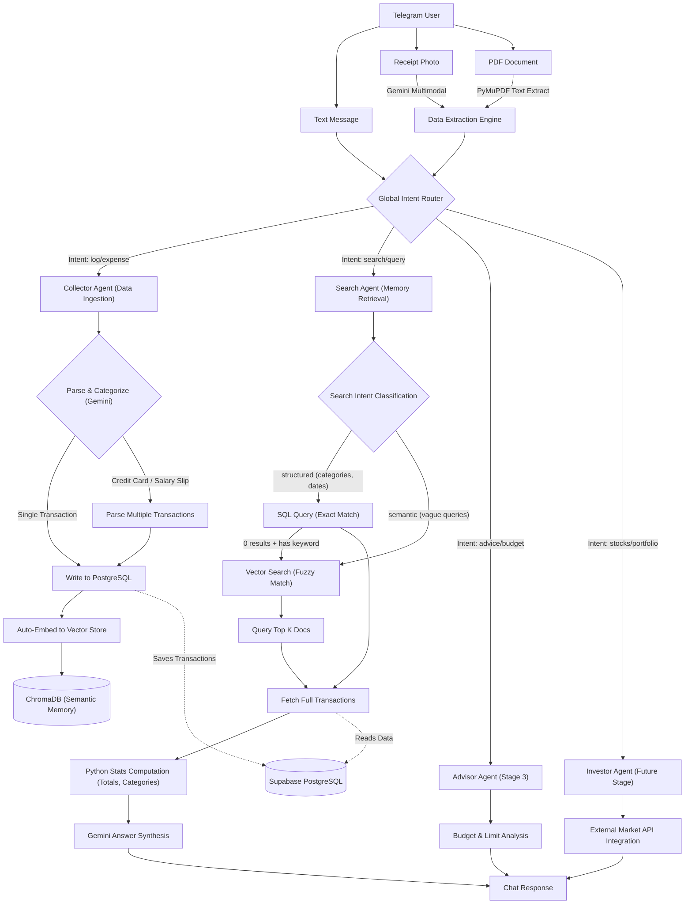

# FinPilot AI — System Architecture Flowchart

This diagram outlines the complete end-to-end architecture of FinPilot AI, covering everything from user input routing to the specialized agents (Collector, Search, Advisor, Investor) and the hybrid retrieval pipeline.

